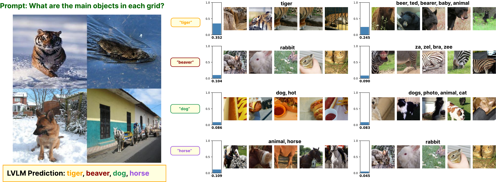
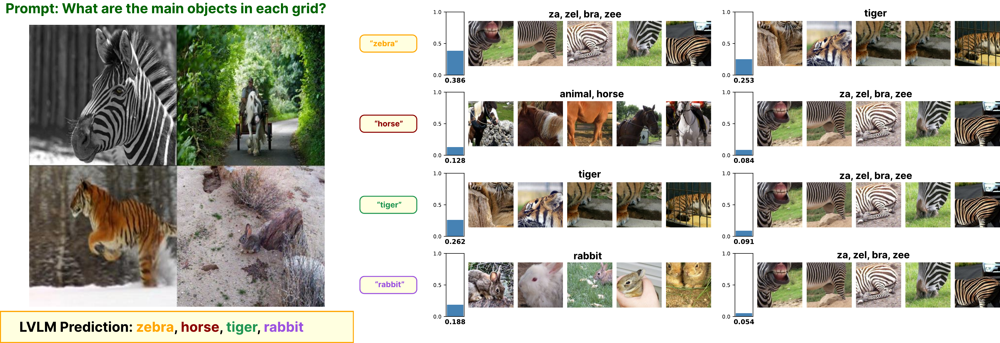
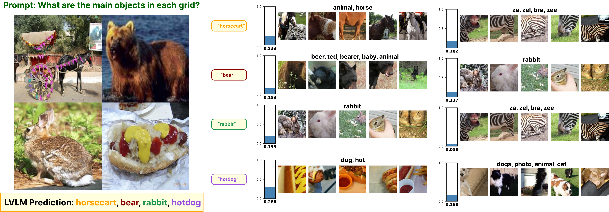

# XL-VLMS: Multimodal Concept Feature Extraction

## Overview
This project provides tools for extracting, analyzing, and decomposing concept features from multimodal data (images and text) using large vision-language models. It includes scripts for feature generation, decomposition, and analysis, as well as a demo notebook for binary task explanation.

## Demo Output

### Token-wise Concept Grounding Visualization

Given a grid of 2x2 images (total 4 different images), the model is tasked to predict the object in each grid cell. For each predicted token, the corresponding residual stream is mapped to relevant concepts. The demo outputs are provided as image files in the `grounding_per_token` directory.

#### Example Visualization


#### What This Visualization Shows

This visualization demonstrates **how the Vision-Language Model (VLM) explains its predictions** by breaking down each token in its output and showing which visual concepts contribute to that token's generation.

**Layout Structure:**

1. **Top Section - Input & Prediction:**
   - **Prompt**: The question asked to the model (e.g., "What are items in each grid?")
   - **Input Image Grid**: A 2×2 grid showing 4 different images (in this example: fruit baskets, market scenes, and kitchen interiors)
   - **Model Prediction**: The VLM's complete response shown in a highlighted box (e.g., "fruits and vegetables fruits and vegetables kitchen fruits and vegetables fruits and vegetables")

2. **Bottom Section - Token-wise Explanations:**
   Each row explains **one token** from the prediction:
   - **Token Label** (left): The specific token being explained (e.g., "fr", "uits", "and", "vegetables", "kitchen")
   - **Concept Similarity Bar** (middle): A vertical bar chart showing:
     - **Concept Name**: The semantic concept associated with this token (e.g., "fruit, apple, based", "refrigerator, freezer", "vegetable")
     - **Similarity Score**: A numerical value (0.0-1.0) indicating how strongly this concept contributes to the token's generation
     - The bar extends upward from the bottom, with the score displayed at the base
   - **Visual Examples** (right): 5-6 small image crops showing real examples of visual elements that activate this concept

#### What This Explanation Means

This visualization provides **interpretability** for the VLM's decision-making process:

- **Token-level transparency**: You can see exactly which concepts the model uses when generating each word
- **Concept grounding**: Each concept is grounded in actual visual examples (the image crops), showing what the model "sees" when it thinks about that concept
- **Similarity scores**: Higher scores indicate stronger activation - concepts with scores >0.3 are typically the primary drivers for that token
- **Multi-concept activation**: A single token (like "fruits") may activate multiple related concepts (fruit, apple, food, etc.), showing the model's rich semantic understanding

**Example Interpretation:**
- When the model generates "fruits", it primarily activates concepts like "fruit, apple, based" (score: 0.394) and "food, based" (score: 0.381)
- The visual crops show actual fruit images (apples, bananas, grapes) that the model associates with this concept
- This demonstrates that the model isn't just pattern-matching text, but genuinely connecting visual features to semantic concepts

This type of explanation is crucial for **debugging model behavior**, **understanding failures**, and **validating that the model is using appropriate visual reasoning** rather than spurious correlations.


#### Additional Example Visualizations:







## 📦 Installation

1. **Clone the repository**
   ```bash
   git clone <repo_url>
   cd xl-vlms
   ```

2. **Set up Python environment**
   - Recommended: Python 3.10
   - You can use Conda or a virtualenv:
     ```bash
     conda create -n xlvlms python=3.10
     conda activate xlvlms
     # or
     python3 -m venv .venv
     source .venv/bin/activate
     ```

3. **Install dependencies**
   - Using pip:
     ```bash
     pip install torch torchvision --index-url https://download.pytorch.org/whl/cu126
     pip install tqdm git+https://github.com/bckim92/language-evaluation.git psutil spacy timm accelerate
     python -m spacy download en_core_web_sm
     
     # For BERTScore and CLIPScore evaluation:
     pip install bert-score
     pip install git+https://github.com/openai/CLIP.git
     
     # For Qwen model support:
     pip install qwen-vl-utils
     conda install -c conda-forge inflect
     conda install -c conda-forge scikit-learn
     # For Java support (if needed):
     conda install -c conda-forge openjdk
     # Download COCO evaluation data:
     python -c "import language_evaluation; language_evaluation.download('coco')"

     pip install -U git+https://github.com/luca-medeiros/lang-segment-anything.git
     ```

## ⚙️ Configuration

### Environment Setup with `.env`

The pipeline uses a `.env` file for easy configuration management. This keeps your custom paths separate from the code.

1. **Copy the example configuration**
   ```bash
   cp .env.example .env
   ```

2. **Edit `.env` with your paths**
   ```bash
   nano .env  # or use your preferred editor
   ```

3. **Key configuration variables**
   
   The `.env` file supports the following variables:
   
   ```bash
   # Data & Output Paths
   export INPUT_DIR="/path/to/your/dataset"
   export OUTPUT_DIR="$ROOT_DIR/outputs/your_run_name"
   export HF_HOME="/path/to/huggingface/models"
   
   # Crops Configuration
   export MIN_IMAGES_PER_TAG=20  # Use 10 for dummy data at xl-vlms/data
   
   # Optional: Model Configuration
   export VLM_MODEL="Qwen/Qwen2.5-VL-3B-Instruct"
   export BATCH_SIZE=48
   export DEVICE_ID=0
   export DECOMP_METHODS="snmf"
   ```

4. **Using `$ROOT_DIR` variable**
   
   The `.env` file has access to `$ROOT_DIR` (the xl-vlms project directory):
   ```bash
   # Use $ROOT_DIR for paths inside the project
   export OUTPUT_DIR="$ROOT_DIR/outputs/my_experiment"
   export IMAGE_ROOT="$ROOT_DIR/data/grids"
   
   # Use absolute paths for external resources
   export INPUT_DIR="/mnt/sda/datasets/food-101"
   export HF_HOME="/mnt/sdz/models"
   ```

5. **Quick configuration switching**
   
   For dummy/test data:
   ```bash
   export INPUT_DIR="$ROOT_DIR/data"
   export MIN_IMAGES_PER_TAG=10
   export OUTPUT_DIR="$ROOT_DIR/outputs/test_run"
   ```
   
   For full datasets:
   ```bash
   export INPUT_DIR="/path/to/full/dataset"
   export MIN_IMAGES_PER_TAG=20
   export OUTPUT_DIR="$ROOT_DIR/outputs/production_run"
   ```

**Note:** The `.env` file is ignored by git (in `.gitignore`) to keep your local paths private. Use `.env.example` as a template for sharing configuration structure.

### Full Pipeline (Recommended)

The easiest way to run the complete pipeline:

1. **Configure your environment** (see Configuration section above)
   ```bash
   cp .env.example .env
   nano .env  # Edit with your paths
   ```

2. **Run the full pipeline**
   ```bash
   ./scripts/run_full_pipeline_without_coroping.sh
   ```
   
   The script automatically loads your `.env` configuration and runs:
   - Dataset inference → concept mapping
   - Crop generation with concept grounding
   - Feature extraction
   - Feature decomposition (SNMF/NMF/PCA)
   - VLM explanation
   - Concept deletion/insertion evaluation
   - Visualization plots

3. **Results location**
   ```
   $OUTPUT_DIR/
   ├── inference/           # Concepts and crops
   ├── features/            # Extracted features
   ├── concept/             # Decomposed concepts per method
   ├── explanations/        # VLM explanations per method
   ├── eval/                # Evaluation results (CSV files)
   └── plots/               # Visualizations
   ```

4. **Command-line overrides** (optional)
   ```bash
   # Override specific variables without editing .env
   MIN_IMAGES_PER_TAG=5 OUTPUT_DIR="./outputs/quick_test" \
     ./scripts/run_full_pipeline_without_coroping.sh
   
   # Or use flags
   ./scripts/run_full_pipeline_without_coroping.sh \
     --input-dir /path/to/data \
     --output-dir ./outputs/experiment_1 \
     --decomp snmf,nmf,pca
   ```

All results will be found in the `eval/` folder of your configured output directory.

## Complete Workflow: Pipeline → Visualization → Evaluation

Follow these steps in order to run the complete analysis pipeline:

### Step 1: Run the Full Pipeline

Run the main pipeline script to generate all intermediate results:

```bash
./scripts/run_full_pipeline_without_coroping.sh
```

This generates:
- Concept mappings and crops
- Feature extractions
- Decomposed concepts (per method: snmf, nmf, pca, etc.)
- VLM explanations (`explanations/{method}/vlm_explanations.json`)
- Concept deletion/insertion evaluation results

### Step 2: Run Visualization Notebook

Generate per-token concept grounding visualizations:

```bash
jupyter notebook output_vis.ipynb
```

**Or run programmatically:**
```bash
jupyter nbconvert --to notebook --execute output_vis.ipynb
```

The notebook automatically:
- Loads your `.env` configuration to find `OUTPUT_DIR`
- Reads explanations from `$OUTPUT_DIR/explanations/{method}/vlm_explanations.json`
- Generates per-token visualizations saved to `$OUTPUT_DIR/plots/grounding_per_token/`

**Manual configuration (if needed):**
If the notebook doesn't auto-detect your output directory, you can manually set paths in the notebook:
```python
EXPLANATIONS_JSON = "/path/to/your/explanations/snmf/vlm_explanations.json"
VIZ_OUTPUT_DIR = "/path/to/output/plots/grounding_per_token"
```

### Step 3: Run BERTScore and CLIPScore Evaluation

Evaluate the quality of explanations using BERTScore (text similarity) and CLIPScore (image similarity):

**For a single explanations file:**
```bash
python clip_bert_score_explanation.py \
    --json_path outputs/your_run/explanations/snmf/vlm_explanations.json
```

**For batch evaluation across multiple methods:**
```bash
python clip_bert_score_explanation.py \
    --root_dir outputs/your_run \
    --decomp_method snmf \
    --output_csv outputs/your_run/eval/snmf/bert_clip_scores.csv
```

**For multiple decomposition methods:**
```bash
# Evaluate each method separately
for method in snmf nmf pca; do
    python clip_bert_score_explanation.py \
        --root_dir outputs/your_run \
        --decomp_method $method \
        --output_csv outputs/your_run/eval/$method/bert_clip_scores.csv
done
```

**Output:**
- Console output with BERTScore and CLIPScore metrics for Top-1, Top-2, Top-3
- CSV file (if `--output_csv` specified) with mean and std for each metric

**Requirements for BERT/CLIP evaluation:**
- CUDA-capable GPU (recommended) or set `BERT_DEVICE=cpu` and `CLIP_DEVICE=cpu`
- `bert-score` package: `pip install bert-score`
- `clip` package: `pip install git+https://github.com/openai/CLIP.git`

## Running the Jupyter Notebook (Detailed)

To visualize the results manually:

1. **Run the notebook:**
```bash
   jupyter notebook output_vis.ipynb
```

2. **The notebook automatically:**
   - Loads configuration from `.env` file
   - Finds explanations JSON from `$OUTPUT_DIR/explanations/{method}/vlm_explanations.json`
   - Generates visualizations for each token
   - Saves outputs to `$OUTPUT_DIR/plots/grounding_per_token/`

3. **Manual path configuration (if needed):**
   
   In the notebook, you can override paths:
```python
   # Override auto-detected paths
   EXPLANATIONS_JSON = "/path/to/your/explanations/snmf/vlm_explanations.json"
   VIZ_OUTPUT_DIR = "/path/to/output/plots/grounding_per_token"
   
   visualize_all_per_token(
       json_path=EXPLANATIONS_JSON,
       save_dir=VIZ_OUTPUT_DIR,
       max_concepts=3,
       max_crops=5,
       concept_size=200
   )
```


## 📂 Folder Structure

- `src/` : Main source code (models, datasets, metrics, helpers, analysis)
- `scripts/` : Feature generation and decomposition scripts
- `preprocessing/` : Preprocessing utilities
- `explaining_binary_task_rsml.ipynb` : Demo notebook
- `install.sh` : Installation script


For questions or issues, please refer to the repository or contact the maintainers.

**Contact:** abdul.kadir@dfki.de